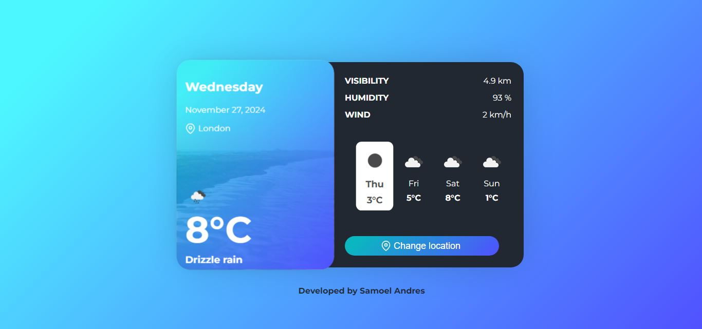

# Tarjeta Clima  

<br><br><br>

## Descripción

**Tarjeta Clima** es una aplicación web que muestra la información meteorológica actual y pronóstico a corto plazo. El proyecto hace uso de la API de OpenWeather para obtener datos meteorológicos, los cuales son luego procesados y presentados en una interfaz amigable.



## Características

- Muestra el clima actual de una ubicación especificada.
- Muestra el pronóstico meteorológico de los próximos días.
- Información detallada: temperatura, humedad, viento, visibilidad, y descripción del clima.
  
## Tecnologías Utilizadas

- **PHP**: Lenguaje de programación para la lógica de backend y consumo de la API.
- **HTML/CSS**: Estructura y estilo de la interfaz de usuario.
- **JavaScript**: Para mejorar la interacción y hacer que la interfaz sea más dinámica.
- **API de OpenWeather**: Fuente para obtener los datos meteorológicos.

## Instalación

### Requisitos

- PHP 7.0 o superior.
- Composer para gestionar las dependencias.
- Un servidor web como Apache o Nginx.
- Acceso a la API de OpenWeather (requiere una clave de API).

### Pasos para ejecutar el proyecto

1. **Clona el repositorio:**

   ```bash
   git clone https://github.com/samoel-andres/tarjeta-clima.git
   ```

2. **Instala las dependencias de PHP (si es necesario):**

   ```bash
   composer install
   ```

3. **Obtén una clave de API de OpenWeather:**

   - Regístrate en [OpenWeather](https://openweathermap.org/api).
   - Consigue una clave de API para realizar las solicitudes.

4. **Configura tu clave de API:**

   - Crea un archivo `.env` en la raíz del proyecto.
   - Añade la clave de API de OpenWeather de la siguiente manera:

   ```
   OPENWEATHER_API_KEY=tu_clave_aqui
   ```

5. **Ejecuta el proyecto en tu servidor local:**

   Si estás utilizando Apache o Nginx, asegúrate de que el servidor apunte a la carpeta del proyecto.

6. **Accede a la aplicación:**

   Abre tu navegador y ve a `http://localhost/tarjeta-clima`.

## Uso

1. Al cargar la página, se muestra el clima actual de una ciudad predeterminada (ej. Londres).
2. Se visualiza el pronóstico para los próximos días con detalles como la temperatura, humedad, velocidad del viento, etc.
